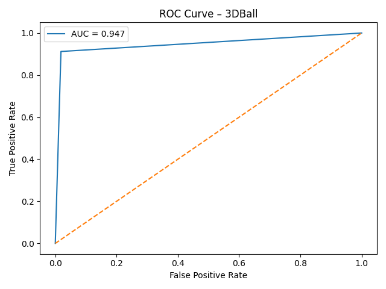
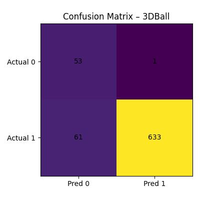

# Machine Learning Prediction Models

## Overview
This directory contains the code for training and evaluating machine learning models for predicting reachability, steps, and time-to-threshold based on the collected datasets. The models are implemented using scikit-learn and can be trained and evaluated using the prediction command-line interfaces (CLI).

## Datasets 
The latest datasets can be found in the ```data/normalized``` directory. Data snapshots are available in the ```data/snapshots``` directory. Snapshots are normalized and contain only the features used in the models.

## Models CLI
> Try Models CLI on all collected environments and datasets through GitHub actions here: https://github.com/omarelfiki/unity-ml-drl-data/actions/workflows/run_models.yml
> 
> Once completed, the results will be available in the artifacts tab of the workflow run as a zip file containing the collected models and results. A sample of the results can be found in the ```experiments/``` directory.

The ML models CLI can be used to train and evaluate the models on the collected datasets. Existing models can be used to make predictions on new data using the ```--models-dir``` flag.

From within the ```models/``` directory:
```
usage: python -m scripts.run [-h] [--test_size TEST_SIZE] [--seed SEED] [--thresh THRESH] [--env ENV] [--models-dir MODELS_DIR] [--data-csv, type=str DATA_CSV]

options:
  -h, --help            show this help message and exit
  --test_size           Fraction of data used as test set (default: 0.2).
  --seed                Random seed for reproducible splitting (default: 42).
  --thresh              Threshold for pred_reach from p_reach (default: 0.5).
  --env ENV             Environment to use (default: None).
  --models-dir          Directory containing standard model names: `logistic_reach_model.joblib`, `linear_steps_model.joblib`, `linear_time_model.joblib`.
  --data-csv            Path to CSV containing data. Defaults to latest data in ../data/normalized/.
```
The prediction CLI will output a versioned directory under ```experiments/``` containing the results of the prediction such as metadata, joblib files containing the trained models, and a CSV file containing the predictions.

## Cross Validation
The CLI can be used to perform cross validation on the collected datasets. It will output a CSV file containing the results of the cross validation such as accuracy, precision, recall, F1-score for reachability model, and RMSE, MAE for steps and time-to-threshold models.

| fold | accuracy           | f1                 | steps_mse          | steps-mae          | time_mse           | time_mae           |
|------|--------------------|--------------------|--------------------|--------------------|--------------------|--------------------|
| 0    | 0.8831168831168831 | 0.9326347305389222 | 8665995544.099108  | 20792.00480138349  | 16502.923007408288 | 29.220886992381736 |
| 1    | 0.8831168831168831 | 0.9331352154531947 | 8010460316.885493  | 30778.434103350235 | 72074.08826083166  | 39.27999359152022  |
| 2    | 0.8868660598179454 | 0.9356032568467801 | 1289652796.434547  | 18768.28678058233  | 2217.3410889146653 | 25.690729257995397 |
| 3    | 0.8673602080624188 | 0.9235382308845578 | 634909461.0406405  | 16378.027367047129 | 1311.6920437203266 | 22.965142143900827 |
| 4    | 0.8595578673602081 | 0.9190404797601199 | 1561773206.3131857 | 19857.363520993866 | 824.4540386839404  | 21.396068279679547 |

## Models Details
### 1. Logistic Regression
The logistic regression model is trained on the reachability data and predicts reachability probabilities.
### 2. Linear Regression
The linear regression models are trained on the steps and time-to-threshold data and predict reachability, steps, and time-to-threshold.

## Analysis 
The ```analysis/``` directory within each experiment contains analysis of the models.
Analysis includes feature ROC-AUC plots, prediction vs actual confusion matrix, and residual plots for each model.

Example ROC-AUC plots for the 3DBall environment:
<p align="center">
  <table>
    <tr>
      <td align="center">
        
      </td>
      <td align="center">
        
      </td>
    </tr>
    <tr>
      <td align="center"><b>ROC Curve</b></td>
      <td align="center"><b>Confusion Matrix</b></td>
    </tr>
  </table>